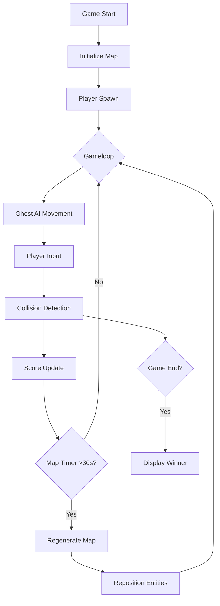

# AI-Powered Dynamic Pacman: Two-Player Edition

<div align="center">
  
  [](https://www.python.org/)
  [](https://www.pygame.org/)

</div>

Watch the demo video [here](https://github.com/laibaa1209/TwoPlayeredPacman-AI-Project/blob/main/demo.mp4).

## Project Overview
A modern twist on classic Pacman featuring:
- **Competitive two-player mode** with score tracking
- **Dynamic map regeneration** every 30 seconds
- **Intelligent ghosts** using multiple AI algorithms (A*, BFS, Min-Max, Genetic Algorithm)
- **New power-ups** like ghost freezing
- **Adaptive gameplay** with multiple win conditions

## Key Features
| Feature | Description |
|---------|-------------|
| 🕹️ Dual Players | Compete head-to-head as Pacman characters |
| 🧠 Smart Ghosts | AI-driven enemies with pathfinding strategies |
| 🗺️ Living Maze | Map reshapes dynamically during gameplay |
| ⏳ Ghost Freeze | Temporary power-up to evade capture |
| 🏆 Multiple Win Conditions | Score-based or survival-based victory |

## 📊 Program Architecture


##  Installation

```bash
# Clone repository
git clone https://github.com/yourusername/ai-pacman.git

# Install dependencies
pip install pygame numpy

# Run game
python main.py
```

---

## Game Rules

### 🎮 Players:
- Control Pacman characters using **Arrow** or **WASD** keys
- **Collect pellets** to increase your score

### Ghosts:
- Controlled by **AI algorithms** to chase Pacmen
- Can be **frozen temporarily** using power-ups

### Winning:
- **Ghosts win** if both Pacmen are caught
- **Last surviving Pacman wins** if one remains
- **Highest scorer wins** if all pellets are eaten

---

## 👥 Team Contributions

| Member             | Role                                 |
|--------------------|--------------------------------------|
| Laiba Bint-e-Zia   | Genetic Algorithm, UI Design         |
| Amna               | Min-Max Algorithm, Dynamic Maps      |
| Alisha Zaidi       | A* Algorithm, Player Mechanics       |
| Layyana Junaid     | BFS Algorithm, Game Over Logic       |

---
